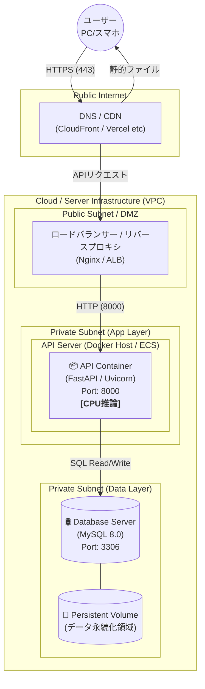

```mermaid
graph TD
    User(("ユーザー<br/>PC/スマホ"))

    subgraph "Public Internet"
        DNS["DNS / CDN<br/>(CloudFront / Vercel etc)"]
    end

    subgraph "Cloud / Server Infrastructure (VPC)"
        
        subgraph "Public Subnet / DMZ"
            LB["ロードバランサー / リバースプロキシ<br/>(Nginx / ALB)"]
        end

        subgraph "Private Subnet (App Layer)"
            subgraph "API Server (Docker Host / ECS)"
                API_Container["📦 API Container<br/>(FastAPI / Uvicorn)<br/>Port: 8000<br/><b>[CPU推論]</b>"]
            end
        end

        subgraph "Private Subnet (Data Layer)"
            DB[("🛢️ Database Server<br/>(MySQL 8.0)<br/>Port: 3306")]
            Volume[("💾 Persistent Volume<br/>(データ永続化領域)")]
        end
    end

    %% Data Flow
    User -- HTTPS (443) --> DNS
    DNS -- "静的ファイル" --> User
    DNS -- "APIリクエスト" --> LB
    LB -- "HTTP (8000)" --> API_Container
    API_Container -- "SQL Read/Write" --> DB
    DB --- Volume
```